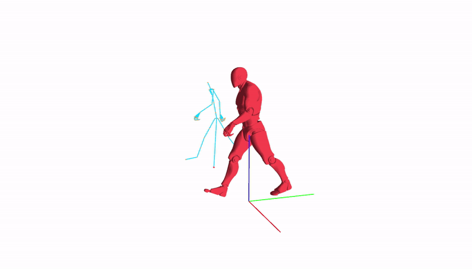
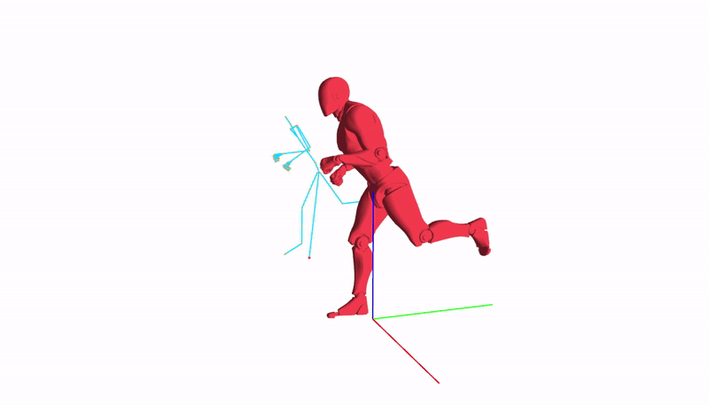
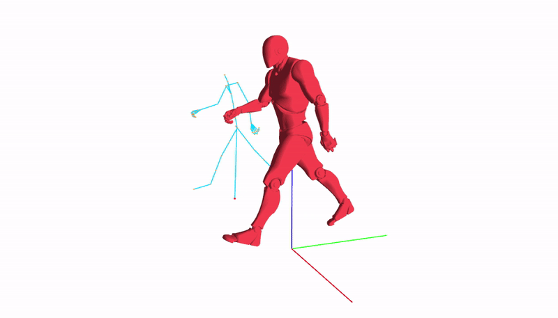
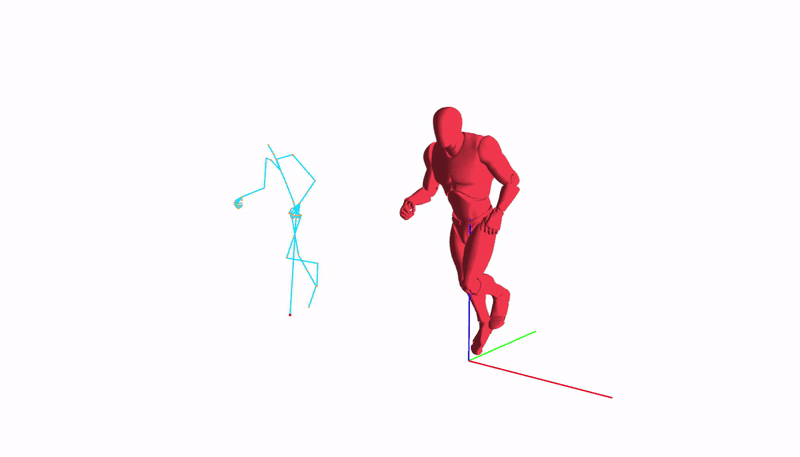

# **Animation Programming**
##### by Axel and Jarod

# Description
This project is made to discover how animation works using Unreal model and animations.

# Information
The engine calls the Init function then calls the Update function. The SkeletalMesh then updates itself. If the user wants to change the animation speed, change the crossfade value or play arround with the values, they have to directly change the SkeletalMesh's update function.
A sample is provided for changing the crossfade value throughout the time.
The user cannot interact in runtime because of the lack of input implemented.

# Controls
| Button | Action |
| -- | -- |
| W, A, S, D | Move arround |
| Left click | Drag to look arround |
| Esc | Quit |
 
# Features
- AnimationPlayer class
    - stores 2 animations
    - can play blended animations
- SkeletalMesh class
    - stores bones loaded from file
    - can draw the skeleton
    - stores an AnimationPlayer
- Hardware skinning

# Showcase
The Skeleton can be animated.

walk animation

run animation

rewind time

# Work in progress and future features
WIP
---
- Crossfade
 
Next features
---
- UI
- Assign buttons to change speed, crossfade value of animation player.

# Known bugs
- Crossfade : when fading from run to walk, the animations are not well synchronised

# References
Wikipedia :
---
- https://en.wikipedia.org/wiki/Slerp#Geometric_Slerp

RayMath :
---
- https://github.com/raysan5/raylib/blob/master/src/raymath.h

C++ :
---
- C++ references: https://en.cppreference.com/